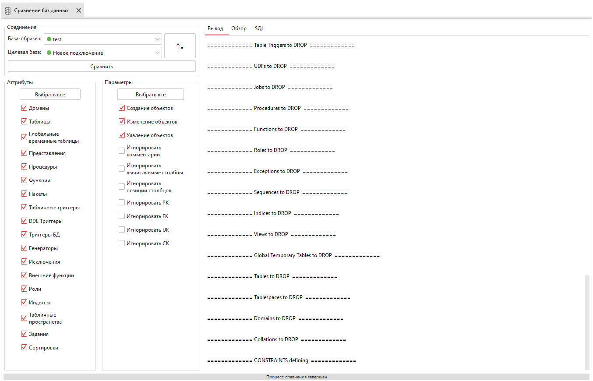

Модуль сравнения баз данных
================================

Инструмент сравнивает две базы данных и генерирует SQL-скрипт, позволяющий сделать две базы идентичными.

.. warning::

    В результате работы сгенерированного SQL-скрипт у выбранных баз будет идентичная структура, но не данные.

    Модуль сравнения баз данных

``База-образец`` – база данных, к состоянию которой нужно привести целевую базу.
``Целевая база`` – база данных, к которой будут применяться изменения.

Блок ``Атрибуты`` представляет собой список элементов базы данных, которые нужно/не нужно учитывать при сравнении.

Блок ``Параметры`` представляет собой список условий, влияющих на сравнение баз и формирование SQL-скрипта, приводящего структуру целевой базы к состоянию базы-образца:

* ``Создание/изменение/удаление объектов`` - добавление в SQL-скрипт запросов для создания/изменения/удаления объектов в целевой базе;
* ``Игнорировать комментарии`` - учитывать ли комментарии при сравнении баз;
* ``Игнорировать вычисляемые столбцы`` – учитывать ли вычисляемые столбцы при сравнении баз;
* ``Игнорировать позиции столбцов`` - учитывать ли позиции столбцов при сравнении баз;
* ``Игнорировать PK/FK/UK/CK`` – учитывать ли ограничения при сравнении баз.

Найденные различия будут записаны во вкладку ``Вывод``. 
Во вкладке SQL будет сформирован скрипт, приводящий структуру целевой базы к структуре базы-образца.

