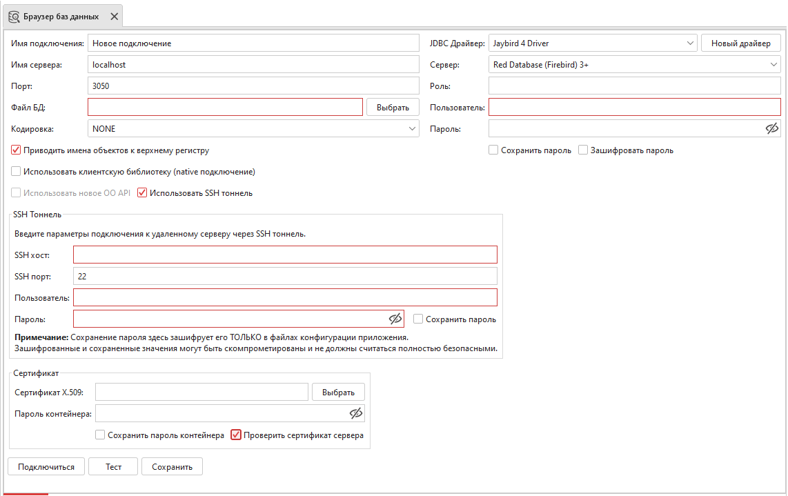
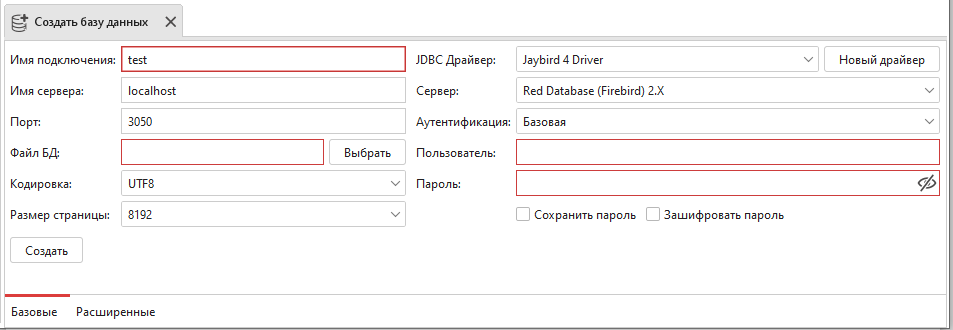

База данных
===============

Инструменты для создания базы данных, подключения к ней, а также для извлечения и сравнения метаданных находятся во вкладке База Данных.

    Вкладка ``База Данных``

Создание подключения
------------------------

Ред Эксперт позволяет одновременно использовать несколько подключений к базе данных.
Информацию о подключении отображает ``«Браузер баз данных»``.

    Браузер баз данных

Для создания подключения выберите соответствующий пункт в меню База данных или нажмите на кнопку ``Создать подключение`` в панели инструментов. 
Заполните поля в открывшемся окне и нажмите на кнопку ``Подключиться``. 

.. note::

    При попытке подключения может возникнуть ошибка шифрования сетевого соединения. 
    Для поддержки шифрования необходима версия ``Java`` не ниже ``1.8.0_161`` или установленное ``JCE`` дополнение. 
    В противном случае следует изменить значение параметра ``WireCrypt = Disabled`` в ``firebird.conf``.

SSH туннель
~~~~~~~~~~~~~~~~

Есть возможность подключиться к базе данных через ``SSH-туннель``. 
Как и при любом ``SSH-соединении``, весь трафик между вами и БД будет шифроваться.
Для этого введите параметры подключения на вкладке ``«Базовые»``, переключитесь на вкладку
``«SSH Тоннель»`` и заполните параметры для ``SSH-соединения``. Имя хоста переносится с вкладки ``«Базовые»``.

    SSH туннель

Сертификат
~~~~~~~~~~~~~~~~

Для аутентификации по сертификату необходимо заполнить следующую форму:

    Сертификат

Расширенные параметры подключения
~~~~~~~~~~~~~~~~~~~~~~~~~~~~~~~~~~~~~~

Дополнительные свойства соединения можно ввести, выбрав вкладку ``«Расширенные»``. 
На ней можно увидеть таблицу с двумя столбцами. Левый соответствует параметру подключения, а правый его значению. 
Обратитесь к документации ``JDBC`` драйвера, чтобы узнать, какие дополнительные параметры подключения к базе данных могут быть установлены.

Также можно выбрать уровень изоляции транзакций. 
Различные уровни изоляции транзакций определяют поведение данного клиентского приложения,
запустившего эту транзакцию, по отношению к другим параллельным процессам, 
выполняющимся на любом компьютере локальной сети, 
одновременно выполняющих чтение или изменение в той же базе данных, что и текущий процесс.
Для Ред Базы Данных и Firebird по умолчанию используется ``READ_COMMITED``.
Подробное описание расширенных параметров подключения см. в разделе :ref:`db_extended_connection`.

Создание базы данных
-----------------------------

Для создания базы данных выберите соответствующий пункт в меню ``База данных`` 
или нажмите на кнопку ``Создать базу данных`` в панели инструментов. 
Заполните поля в открывшемся окне и нажмите на кнопку ``Создать``. 
Подробное описание полей см. в разделе :ref:`db_connection`.

    Создание базы данных

.. note::
    
    При попытке создания базы данных может возникнуть ошибка шифрования сетевого соединения. 
    Для поддержки шифрования необходима версия ``Java`` не ниже ``1.8.0_161`` или установленное ``JCE`` дополнение. 
    В противном случае следует изменить значение параметра ``WireCrypt = Disabled`` в ``firebird.conf``.

Выполнить SQL-скрипт из файла
~~~~~~~~~~~~~~~~~~~~~~~~~~~~~~~~~~~~

Выберите открытое соединение и укажите путь к файлу с SQL-скриптом и нажмите кнопку ``Начать``.
Сделайте ``commit`` или ``rollback`` транзакции, нажав на соответствующие кнопки.

    Выполнить SQL-скрипт из файла

Импорт подключения
-----------------------

Для тех, у кого уже есть настроенные в ``IBExpert`` подключения, разработана опция импорта подключений.
Запустите Ред Эксперт и подключитесь к нужной пользовательской базе данных. 
Выберите пункт меню База данных :math:`\to` Импортировать подключения :math:`\to` Импортировать из базы данных и выберите нужное подключение в открывшемся окне.

    Импорт подключения из базы данных

Также доступен импорт подключения из файла:

    Импорт подключения из файла

Экспорт подключения
-----------------------

Для экспорта подключения в файл выберите пункт меню База данных :math:`\to` Экспортировать подключения и выберите нужное подключение в открывшемся окне.

    Экспорт подключения