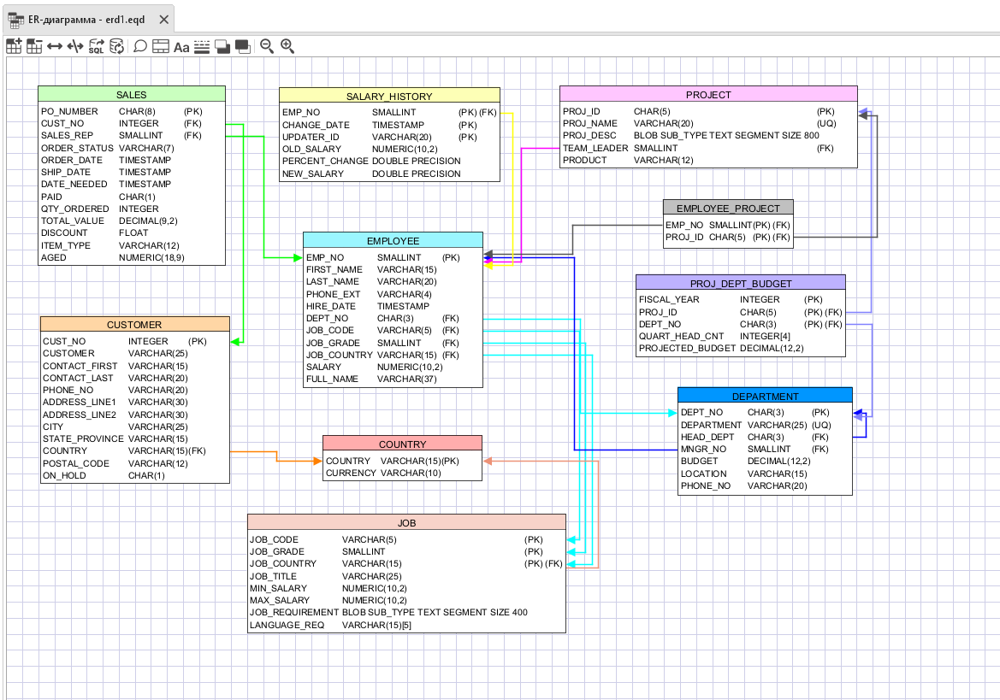

.. _erd:

Редактор ER-диаграмм
==========================

Инструмент предназначен для создания и редактирования ER-диаграмм баз данных.

    Редактор ER-диаграмм

Основные функции:

* Создание и редактирование ER-диаграммы;
* Генерация SQL-скрипта для создания таблиц, представленных на диаграмме;
* Построение ER-диаграммы существующей базы данных;
* Экспорт диаграммы в различные форматы.

