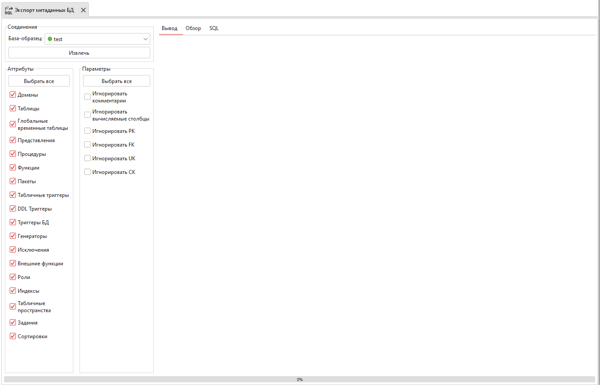
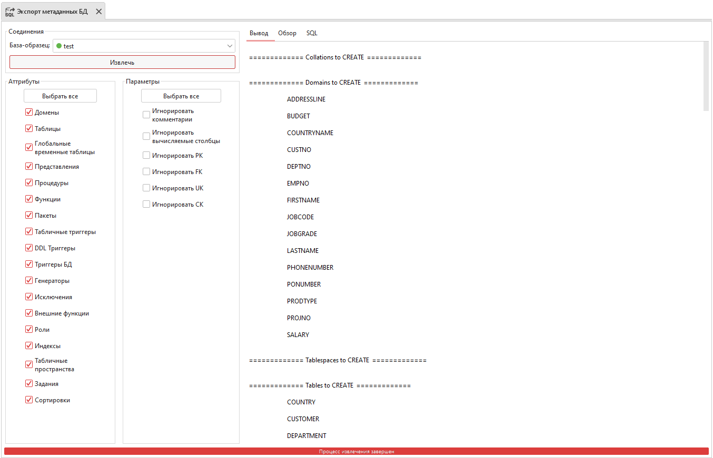

Экспорт метаданных
========================

Инструмент извлекает метаданные выбранной базы данных в SQL-скрипт, выполнение которого позволяет создать дубликат этой базы.

    Экспорт метаданных

``База-образец`` – база данных, метаданные которой нужно извлечь.

Блок ``Атрибуты`` представляет собой список элементов базы данных, которые нужно/не нужно учитывать при экспорте.

Блок ``Параметры`` представляет собой список условий, влияющих на извлечение метаданных и формирование SQL-скрипта, создающего выбранную базу данных:

* ``Игнорировать комментарии`` - учитывать ли комментарии при экспорте;
* ``Игнорировать вычисляемые столбцы`` – учитывать ли вычисляемые столбцы при экспорте;
* ``Игнорировать PK/FK/UK/CK`` – учитывать ли ограничения при экспорте.

Посмотреть результаты экспорта метаданных можно во вкладках Вывод, Обзор и SQL.

Во вкладке Вывод перечислены элементы, метаданные которых были извлечены:

    Вкладка Вывод

Во вкладке Обзор отображены извлечённые элементы, которые будут созданы при выполнении сгенерированного скрипта:

    Вкладка Обзор

Во вкладке SQL размещён сгенерированный SQL-скрипт:

    Вкладка SQL

