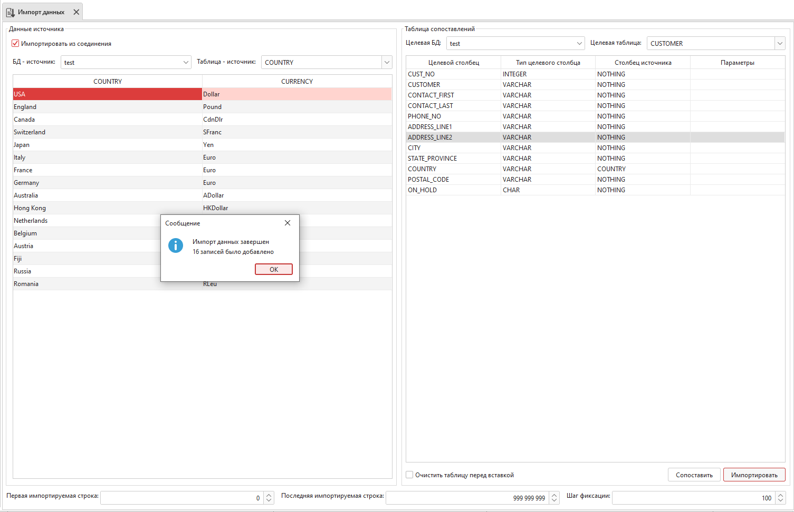

.. _import_date:

Импорт данных
==================

Инструмент для импорта данных из файла в таблицу. Поддерживается импорт из ``XLSX``, ``XML`` и ``CSV`` файлов.

    Импорт данных

Парметры импорта данных:

* ``Импортировать из соединения`` - Позволяет выбрать базу данных в качестве источника.
* ``Файл данных`` - Путь к файлу-источнику данных. Поддерживается импорт из XLSX, XML и CSV файлов.
* ``Файл блобов`` - Путь к файлу-источнику с блобами (с расширением .lob).
* ``Целевая БД`` - База данных, в которую будет производиться импорт.
* ``Целевая таблица`` - Таблица, в которую будет производиться импорт.
* ``Разделитель`` - Тип разделителя данных в CSV файлах.
* ``Количество потоков`` - Количество потоков, используемых для импортирования. Для каждого потока создаётся отдельное подключение. 
* ``Номер страницы`` - Для XLSX файлов можно выбрасть страницу excel-файла, из которой нужно импортировать данные.
* ``Первая импортируемая строка`` - Строка, начиная с которой будут импортированы данные.
* ``Последняя импортируемая строка`` - Строка, поcле которой импорт данных будет прекращён. Строки, непопадающие в диапазон между первой и последней импортируемой строкой, будут проигнорированы.
* ``Шаг фиксации`` - Количество записей, после которого будет произведено подтверждение транзакии и сохранение данных в таблице.
* ``Очистить таблицу перед вставкой`` - Следует ли очистить целевую таблицу от данных, которые в ней были до импорта.
* ``Столбец источника`` - Имя столбца, из которого нужно импортировать данные. Кнопка ``Сопоставить`` автоматически распределяет импортируемые столбцы к целевым столбцам по их именам.
* ``Параметры`` - Импортировать ``BLOB`` как файл или как текст.

    
    Пример заполнения полей

