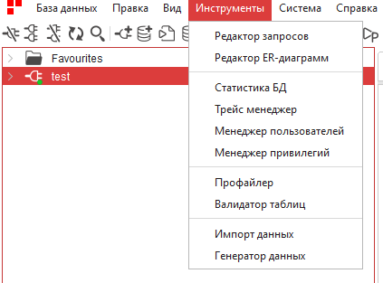

Инструменты
==============

В этой вкладке находятся различные инструменты для работы с базой данных.

    Вкладка ``Инструменты``

Доступные инструменты:

* :ref:`sql_editor`
* :ref:`erd`
* :ref:`stat`
* :ref:`trace`
* :ref:`user_manager`
* :ref:`privilege_manager`
* :ref:`profiler`
* :ref:`validation`
* :ref:`import_date`
* :ref:`generator`