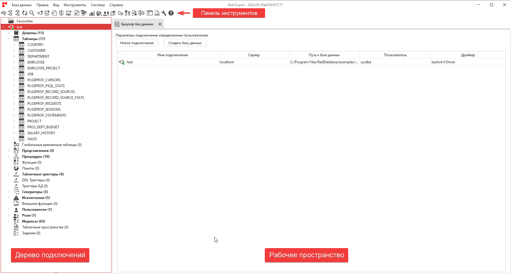
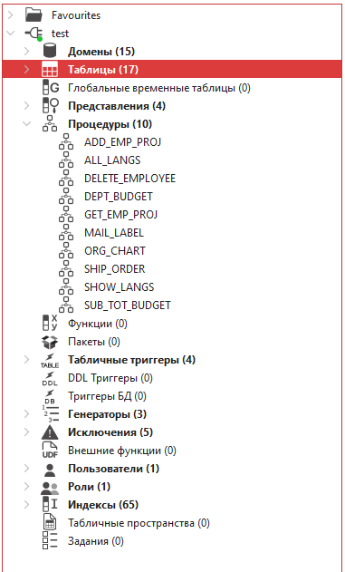
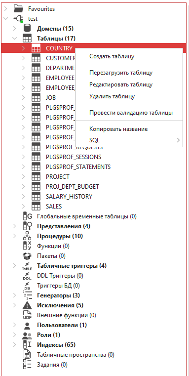
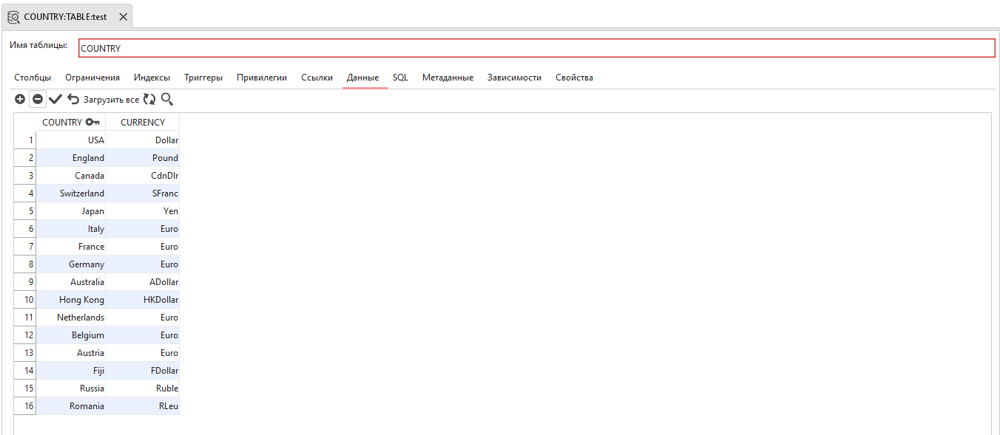

Обзор графического интерфейса
=================================

Интерфейс приложения разделен на три основные части: панель инструментов, дерево подключений и рабочее пространство.

    Интерфейс приложения

1 - панель инструментов;
2 - дерево подключений;
3 - рабочее пространство.

Строка состояния в нижней части приложения отображает информацию о количестве подключений, 
доступных обновлениях, версии ``JDK`` и состоянии памяти.

Панель инструментов
---------------------

На панели инструментов находятся кнопки, позволяющие выполнять различные действия, например, установка соединения с базой 
и отключение от неё, создание новой базы данных или подключения. Также там находятся кнопки для быстрого доступа к инструментам.

    Панель инструментов

Набор кнопок на панели инструментов можно редактировать в меню ``Вид`` или в настройках приложения.

.. Подробное описание кнопок см. в разделе :ref:`toolbar`.

Дерево подключений
-----------------------

После подключения к базе данных на панели появляется структура дерева, узлы которого представляют собой объекты базы данных. 
В скобках указано количество объектов каждого вида.

    Дерево подключений

Клик правой кнопкой мыши по узлу вызовет всплывающее меню с доступными для данного объекта действиями. 

    Доступные действия с таблицей

Двойной клик по объекту откроет вкладку с подробной информацией о нём.

    Информация о таблице

Рабочее пространство
----------------------

В этой области происходит работа с инструментами базы данных и редактирование объектов.

    Рабочее пространство

