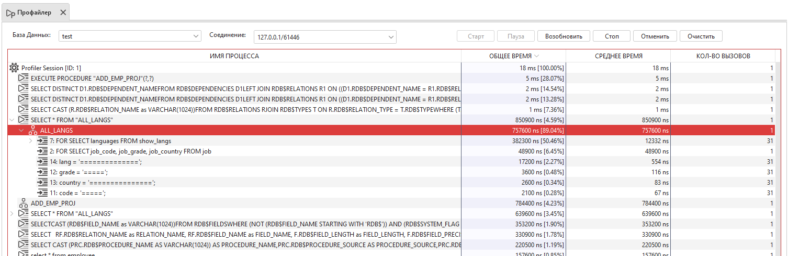

.. _profiler:

Профайлер
===============

Инструмент Профайлер позволяет измерять затраты на производительность ``SQL`` и ``PSQL`` кода.

    Профайлер

Форматы отображения результата: 

* ``Компактное отображение`` – Отображает общую картину выполнения запросов. Повторяющиеся процессы внутри общего родительского будут объединены в один. Является значением по умолчанию.
* ``Расширенное отображение`` – Отображает детализированную картину выполнения запросов. Отоюражается статискика по выполнению каждой строки ``PSQL`` кода, а повторяющиеся операции не объединяются.
* ``Округлять значения`` - Если общее или среднее время больше 1000000ns, то оно будет переводиться в большую единицу измерения, пока значение не станет меньше 1000000. По умолчанию включено.

В ``компактном отображении`` для каждого не последнего узла (за исключением ``ROOT NODE`` - корневого узла) есть узел ``Собственное время``, 
показывающий затраченное время без учета дочерних процессов.

В результирующей таблице отображается информация, собранная профайлером, а именно:

* Имя процесса или SQL-код;
* Затраченное на процесс время в наносекундах (с учетом дочерних процессов) и процент времени от родительского процесса;
* Среднее затраченное на процесс время в наносекундах (с учетом дочерних процессов) для повторяющихся процессов, объединенных в один узел;
* Количество вызовов повторяющихся процессов.

Сессию профайлера можно запустить для одного запроса из редактора запросов кликом по кнопке ``Выполнить в профайлере``. 
В этом случае будет выполнено следующее:

1. Запустится сессия профайлера.
2. Выполнится находящийся в редакторе запрос.
3. Завершится сессия профайлера.
4. Отобразится панель профайлера с собранной информацией.

