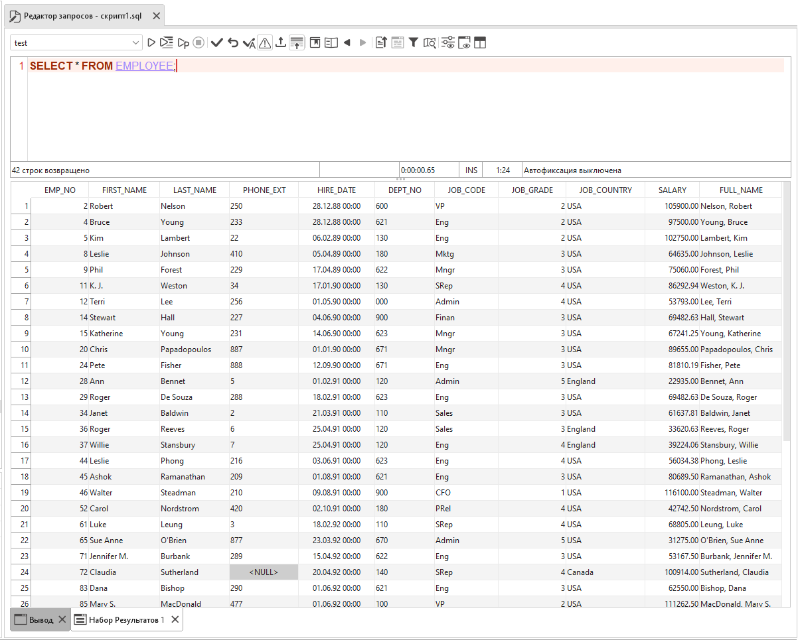
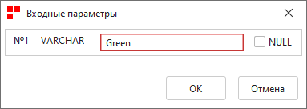
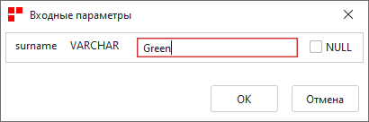

.. _sql_editor:

Редактор запросов
======================

Редактор запросов представляет собой настраиваемый инструмент просмотра и выполнения операторов SQL. В любой момент времени может быть открыто любое количество редакторов.

Редактор поддерживает следующие функции:

* Настраиваемая подсветка синтаксиса SQL;
* Подсказки ключевых слов и имен объектов базы данных;
* Выполнение нескольких запросов;
* Выполнение и отображение нескольких запросов с множеством результатов (``Result Set``);
* Поддержка параметризованных запросов;
* Полная поддержка печати;
* Управление транзакциями;
* Функции текстового редактора стиля IDE - поиск, замена, вставка и т.д.;
* Экспорт результатов;
* Поддержка нескольких открытых соединений;
* Поисковая исполняемая история SQL-запросов;
* Быстрый переход из редактора к просмотру объекта базы данных двойным кликом или нажатием CTRL + Левая клавиша мыши по имени объекта;
* Выбор уровня изоляции транзакции.

    Редактор запросов

Параметризованные запросы
-------------------------------

В некоторых случаях нужно создать запрос, который можно использовать многократно, но каждый раз с разными входными значениями. 
Например, можно написать несколько запросов, чтобы найти данные о сотруднике с определенной фамилией. А можно написать один запрос, меняя только фамилию сотрудника.

Чтобы создать запрос, который в разное время может иметь разные входные данные, используются параметры запроса. 
Параметры могут быть именованными и неименованными. 
Неименованный параметр - это вопросительный знак (``?``), который можно указать в любом месте запроса, вместо литерального значения. Например:

.. code-block::

    SELECT * FROM employee WHERE (surname = ?)  

После запуска такого запроса откроется диалоговое окно для ввода значения параметра (фамилии сотрудника):

    Неименованный параметр 

Именованные параметры - это комбинация двоеточия и имени параметра (``:<paramname>``), которую также можно подставлять вместо литерального значения. 
Именованные параметры особенно полезны, если в запросе их несколько. Например:

.. code-block::

    SELECT * FROM employee WHERE (surname = :surname AND name =:name)  

После запуска такого запроса откроется диалоговое окно для ввода значений параметров (фамилии и имени сотрудника):

    Именованные параметры

История запросов
------------------

После успешного выполнения запрос сохраняется в кэше журнала редактора. 
Количество хранящихся в истории запросов указывается в настройках редактора. 
Сохраненные запросы не теряются после перезапуска приложения или редактора запросов.

