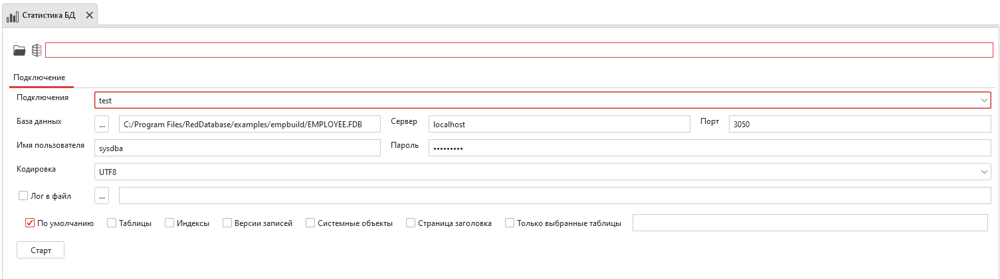
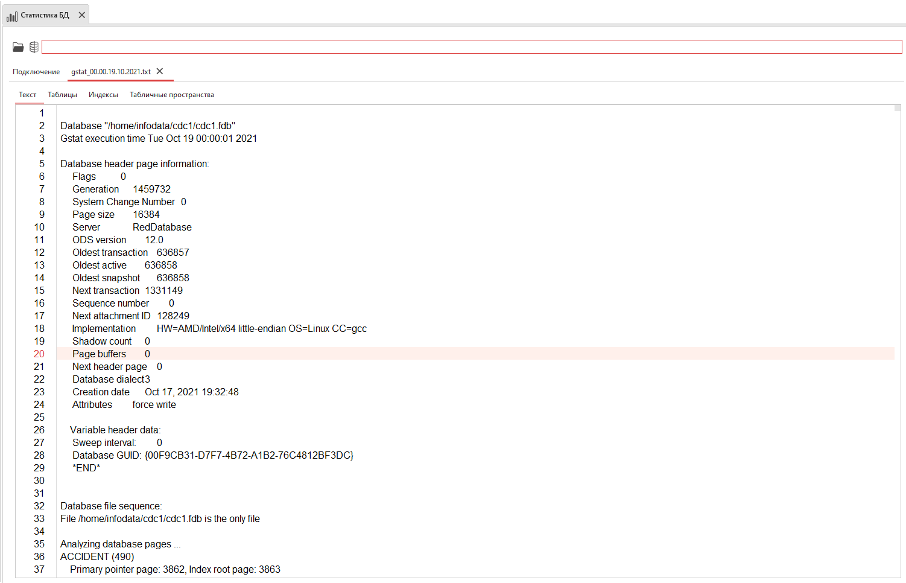
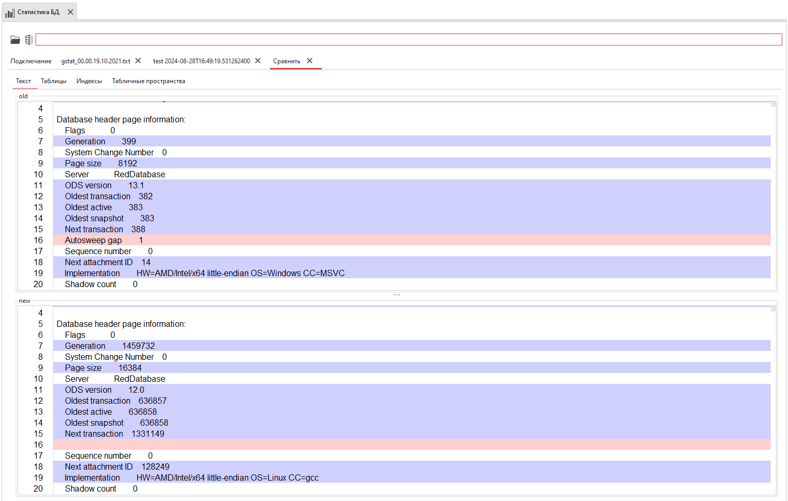
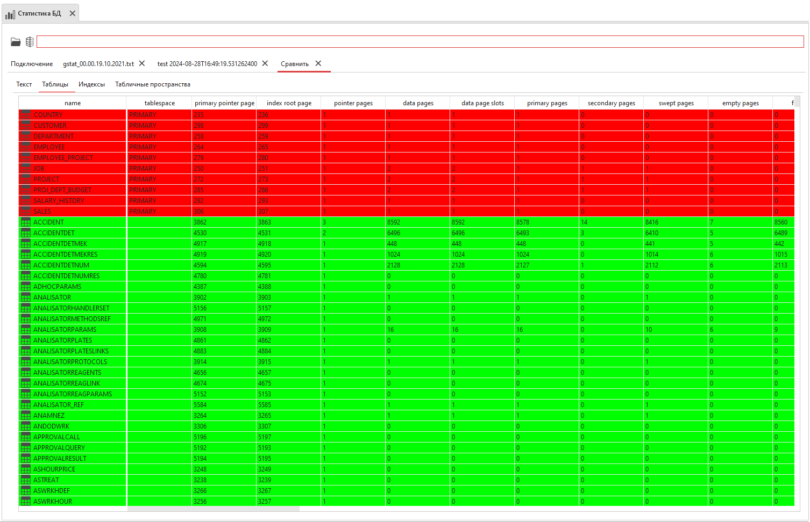

.. _stat:

Статистика БД
===================

Инструмент отображает статистику базы данных, а также позволяет сравнить результаты анализа двух баз.

    Сбор статистики БД

Форматы сбора статистики:

* По умолчанию – анализ всей базы данных, вывод аналогичен выполнению ``gstat`` без опций;
* Таблицы – статистика страниц данных, вывод аналогичен выполнению ``gstat -data``;
* Индексы – анализ индексов, вывод аналогичен ``gstat -index``;
* Версии записей – добавляет статистику о средних длинах записей, количестве версий и информацию о ``BLOB``;
* Системные объекты – анализ системных таблиц и индексов;
* Страница заголовка – статические данные о базе данных, вывод аналогичен ``gstat -header``;
* Только выбранные таблицы – анализ выбранных таблиц, параметр доступен, если установлено соединение с выбранной базой данных.

Собранная статистика оборажается в отдельной вкладке:

    Собранная статистика

Сравнение статистик двух баз
---------------------------------

Для сравнения статистик двух баз данных выполните сбор статистики для второй базы и нажмите кнопку ``Сравнить``.

Во вкладке ``Текст`` будет отображен текстовый вывод статистик:

    Текстовый вывод статистик

Во вкладках ``Таблицы``, ``Индексы`` и  ``Табличные пространства`` значения столбцов показывают разницу между результатом первой и второй базы.  

    Результат сравнения статистик

Зелёным цветом обозначено то, что есть в обеих базах данных.
Красным цветом обозначены таблицы и индексы, которые есть в первой базе, но отсутствуют во второй.