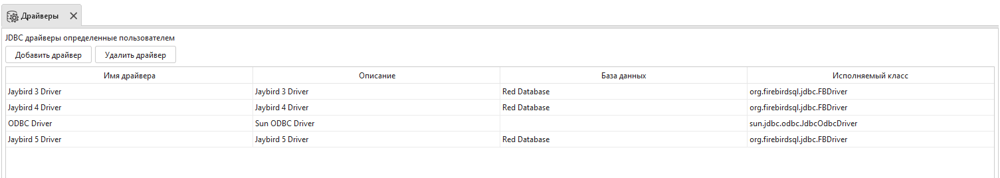
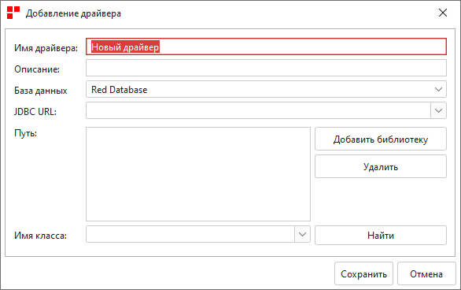
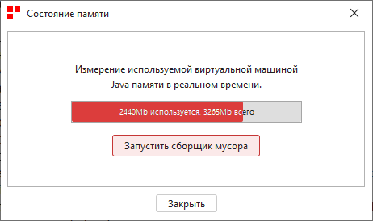
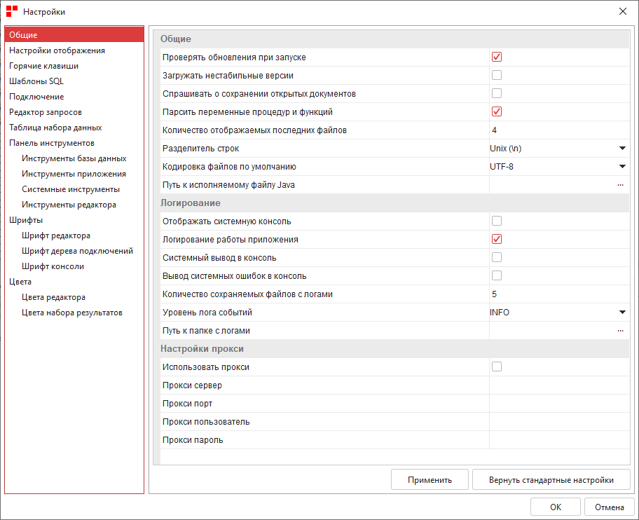

Система
===========

Драйверы
-------------

Панель ``Драйверы`` перечисляет все установленные в настоящее время драйверы ``JDBC``.

По умолчанию в Ред Эксперт установлены библиотеки ``Jaybird 3 Driver``, ``Jaybird 4 Driver``, ``Jaybird 5 Driver``, 
которая позволяет работать с базами данных ``Firebird`` и Ред Базой Данных.

    Драйверы

Для добавления нового драйвера нажмите на кнопку "Добавить драйвер" и заполните все поля. 
Подробное описание полей см. в разделе :ref:`driver`.

    Добавление драйвера
 
Лог приложения
-------------------

В журнал записывается вся информация, которая выводится в стандартный поток вывода, ошибки и предупреждения. 
В Настройках можно задать уровень вывода для ограничения содержащейся в логе информации.

Системный журнал вывода хранится в ``$HOME/.redexpert/logs`` 
и его можно открыть любым текстовым редактором, но можно посмотреть и с помощью Ред Эксперт.

Состояние памяти
------------------

Ред Эксперт позволяет отслеживать текущее использование памяти и запускать сборку мусора.

    Состояние памяти

Настройки
----------------------

Для настройки приложения выберите пункт меню Система :math:`\to` Настройки.

.. note:: 

    Практически все изменения вступают в силу после перезапуска Ред Эксперт.

    Настройки

Портативизация настроек
~~~~~~~~~~~~~~~~~~~~~~~~~~

Чтобы хранить Ред Эксперт и его настройки в одной папке выполните следующие действия:

1. Закройте программу;
2. Откройте файл ``...\каталог c Red Expert\config\redexpert_config.ini``;
3. Для параметра ``eq.user.home.dir`` укажите значение ``../.redexpert`` и сохраните изменения;
4. В адресной строке проводника введите путь ``%homepath%``;
5. Переместите папку ``.redexpert`` в корень каталога, в который установлен Ред Эксперт;
6. Запустите Ред Эксперт.

