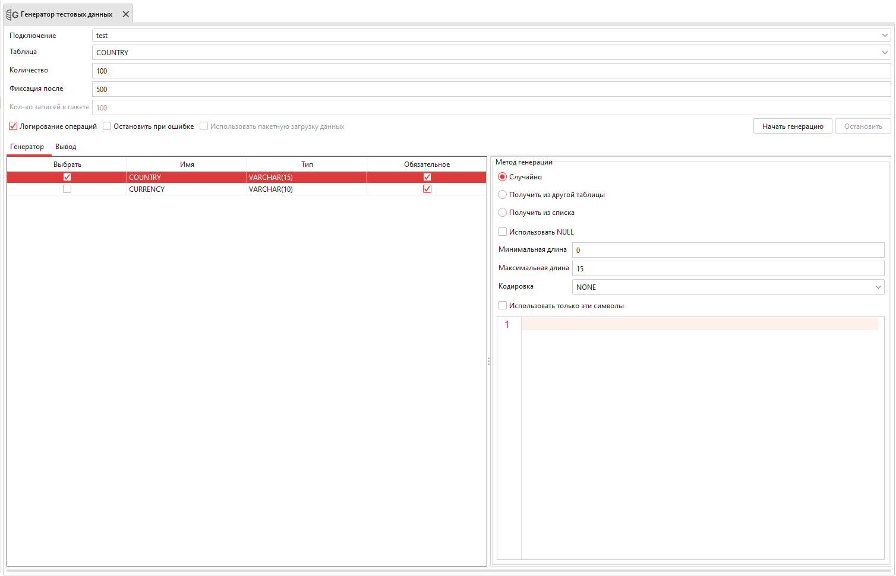

.. _generator:

Генератор тестовых данных
============================

Инструмент ``Генератор тестовых данных`` предназначен для быстрого и удобного заполнения полей таблицы большим объемом данных.

    Генератор тестовых данных

Выберите таблицу. Поля и их типы вы увидите перед собой. 
Напротив поля поставьте галочку, если для него нужно сгенерировать данные. 
Иначе это поле будет заполнено значениями ``NULL``.

Напишите количество записей, которое нужно сгенерировать. 
Генерация больших объемов данных может занять некоторое время.

В поле ``Фиксация после`` введите число строк, после вставки которых будет коммит.

При генерации могут возникать ошибки. По умолчанию они не пишутся в лог-файл. 
Поставьте соответствующую галочку, чтобы все ошибки фиксировались в логе.

Если в процессе генерации возникают ошибки для некоторых записей (например, из-за ограничений столбца), то по умолчанию генератор продолжает свою работу. 
Можно изменить это поведение, поставив галочку для поля ``Остановить при ошибке``.

Можно выбрать метод генерации отдельно для каждого поля таблицы:

* ``Случайно`` - В зависимости от типа поля настраиваются различные параметры генерации.
* ``Получить из другой таблицы`` - В этом методе нужно выбрать таблицу, столбец и количество записей. Записи из таблицы выбираются случайно в указанном количестве, далее из этого списка значений заполняется основная таблица.
* ``Получить из списка`` - Значения списка формируют содержимое поля. Список должен состоять из элементов соответствующего типа данных. Разделителем может выступать любой одиночный символ или escape-последовательность, начинающаяся с обратной косой черты ('\'). Сам список можно ввести вручную в предназначенном для этого поле, либо загрузить из файла.
* ``Автоинкремент`` - Для автоинкремента настраивается начальное значение, шаг и направление движения шага (в сторону увеличения или уменьшения).

