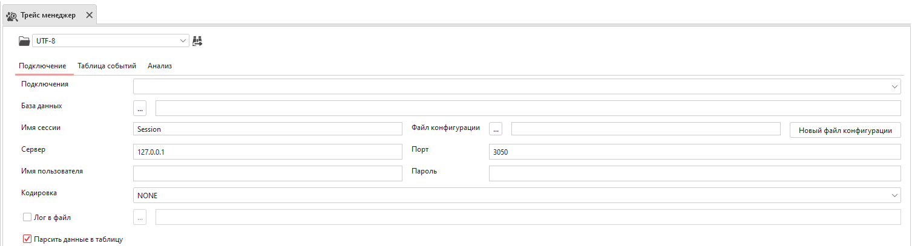
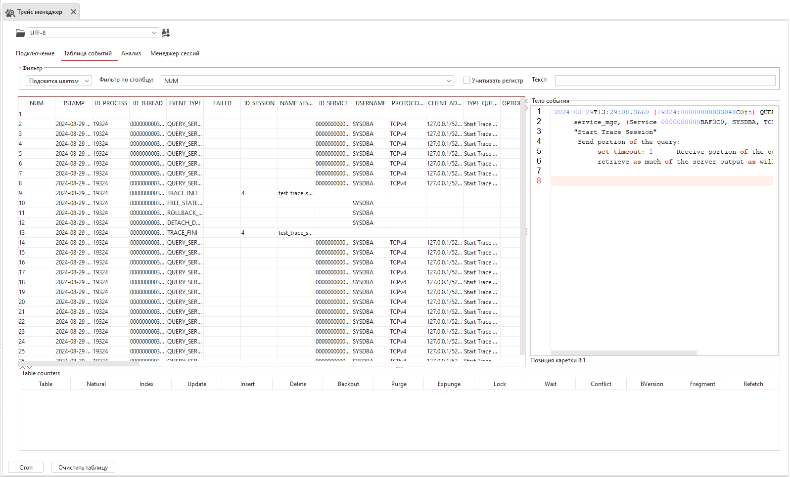
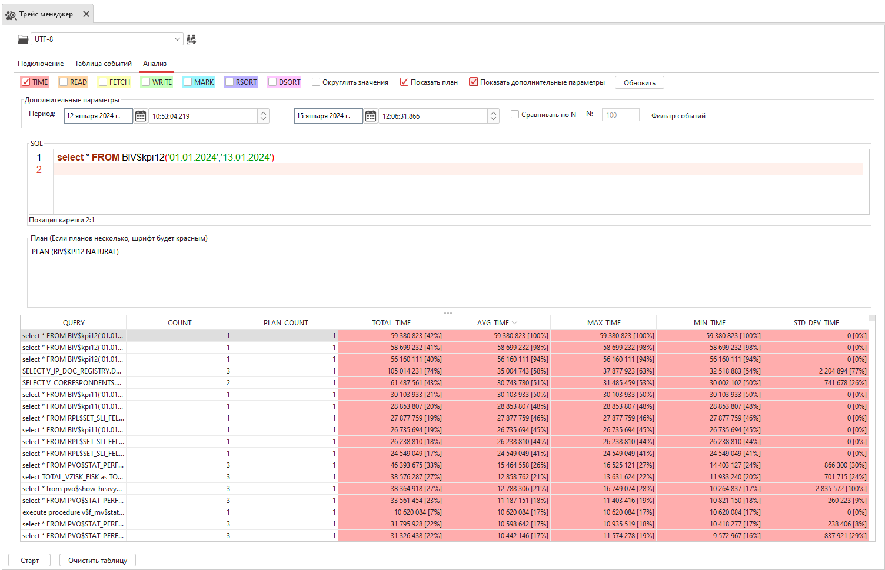
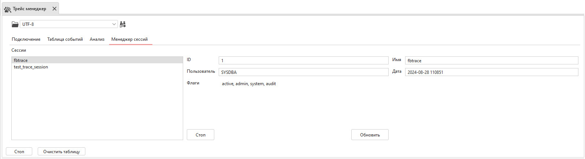

.. _trace:

Трейс менеджер
=====================

Трейс менеджер позволяет отслеживать и анализировать все, что происходит в базе данных в режиме реального времени. 
Он отслеживает и записывает в лог-файлы такие события, как: соединение и отключение от базы данных, 
создание и удаление базы, выполнение ``DML`` и ``DDL``, хранимых процедур и прочее.

    Трейс менеджер

Для включения сервиса аудита необходимо заполнить все поля. 
Можно выбрать сохраненное подключение к базе данных и поля параметров
будут заполнены автоматически на основе этого подключения.

Укажите конфигурационный файл с настройками аудита. 
В зависимости от версии сервера параметры настройки аудита несколько отличаются, 
поэтому из выпадающего списка выберите сервер, соответствующий базе данных.
Настройте параметры аудита и включите трассировку или сохраните их в файле конфигурации. 
.. Описание параметров см. :ref:`trace_conf`.

Таблица событий 
----------------------

Таблица событий в Трейс менеджере заполняется либо при включении трассировки, либо при открытии сохраненного лог-файла. 
При открытии лог-файла есть возможность выбора кодировки.

В таблице событий по умолчанию отображаются все возможные столбцы, содержащие информацию о зарегистрированном событии. 
По желанию некоторые столбцы можно скрыть. Для этого нажмите на кнопку ``Видимые столбцы`` и внесите необходимые изменения.

    Таблица событий

При нажатии Правой кнопки мыши на любую из таблиц, появляется контекстное меню для экспорта таблицы.

Анализ трейса
---------------

Анализ трейса отображает информацию о событиях произошедших в указанный период времени. События добавляются либо при включении трассировки, либо при открытии лог-файла.

Параметры анализа трейса:

* ``TIME`` - Информация о времени выполнения запроса;
* ``READ`` - Информация о количестве страниц, считанных с диска;
* ``FETCH`` - Информация о количестве страниц, считанных из страничного кэша;
* ``WRITE`` - Информация о количестве страниц, записанных на диск;
* ``MARK`` - Информация о количестве страниц, изменённых в страничном кэше;
* ``RSORT`` - Информация об объёме ОЗУ, использованном для сортировки;
* ``DSORT`` - Информация о размере временных файлов, использованных в запросе;
* ``Округлить значения`` - Если значение больше 10000, то оно будет переводиться в большую единицу измерения, пока не станет меньше 10000;
* ``Показать план`` - План выполнения выбранного запроса.

Дополнительные параметры:

* ``Период`` - Период времени, который нужно проанализировать; после изменения периода нужно нажать кнопку ``Обновить``;
* ``Сравнить по N`` - Считать запросы одинаковыми, если у них совпадают первые ``N`` символов;
* ``Фильтр событий`` - Позволяет выбрать типы событий, которые нужно анализировать.

    Результирующая таблица

При наведении на ячейку в всплывающей подсказке будет показана сумма значений столбца и среднее значение. 
Для просмотра полного текста запроса и его плана нужно выбрать ячейку. 
При двойном клике откроется окно с записью события в текстовом формате.

Менеджер сессий
------------------

Менеджер сессий отображает список всех доступных в настоящее время сеансов трассировки. 
Вкладка менеджера видна только при запущенной текущей сессии аудита. 

    Менеджер сессиий

В окне слева можно выбрать имя сессии и посмотреть информацию о ней (``ID``, запустившего пользователя, время запуска), 
а также завершить сеанс трассировки.

