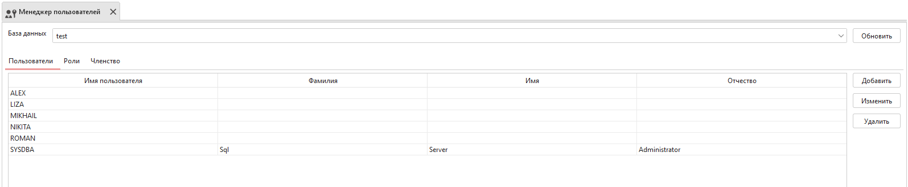
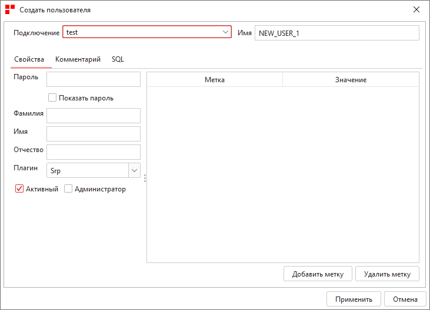

.. _user_manager:

Менеджер пользователей
===========================

С помощью Менеджера пользователей можно управлять пользователями базы данных: добавлять, редактировать и удалять. 

    Менеджер пользователей

Для добавления, изменения и удаления пользователя нужно нажать на соответствующую кнопку и заполнить все поля в открывшемся окне.

    Добавление пользователя