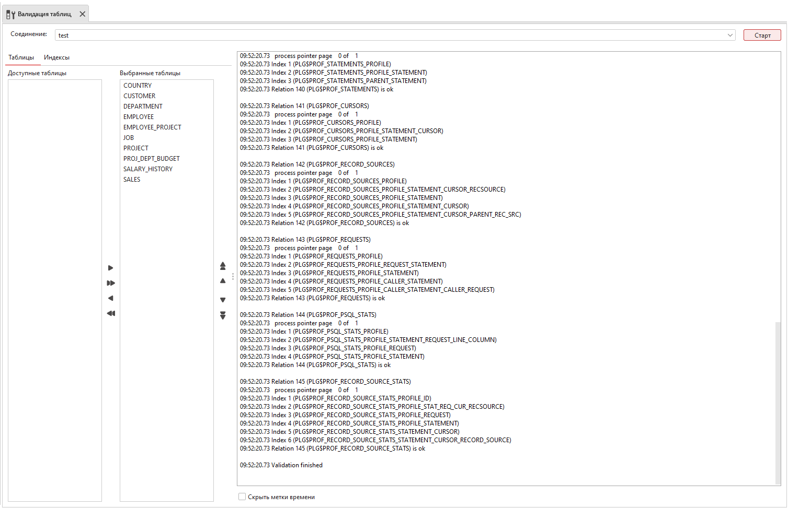

.. _validation:

Валидация таблиц
===================

Проверка базы данных позволяет выполнять низкоуровневые проверки согласованности данных на диске.

Онлайн-проверка может делать следующее:

* проверять некоторые (или все) пользовательские таблицы в базе данных; системные таблицы не проверяются;
* проверять некоторые (или все) индексы;

.. warning::
    
    Другие проверки ODS, такие как страницы заголовка (``Header``), ``PIP``, ``TIP``, страницы генераторов (``Generators pages``) не выполняются.

    Валидация таблиц

